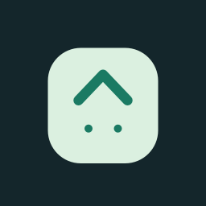
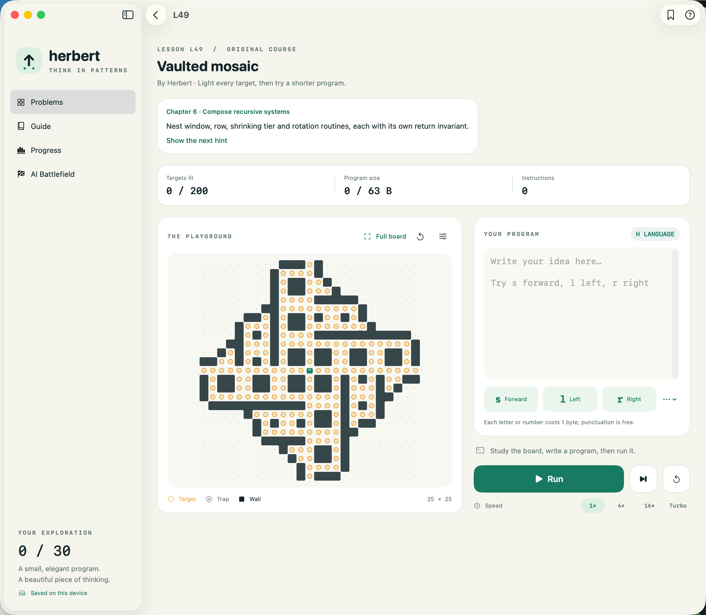
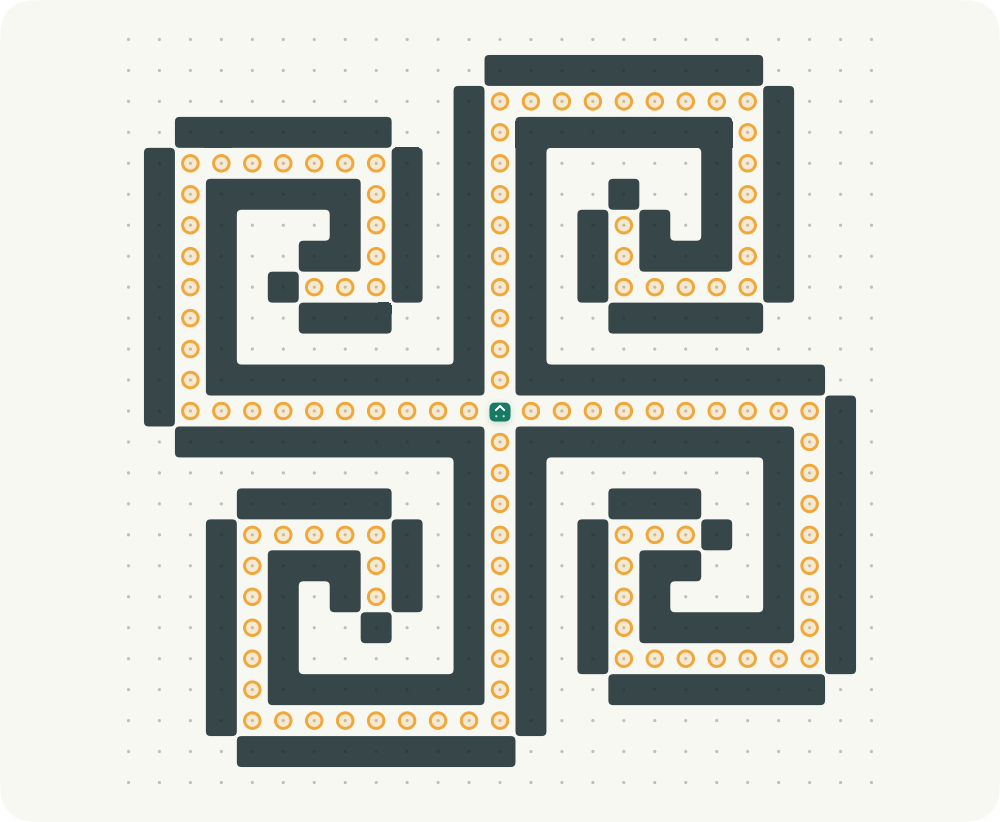
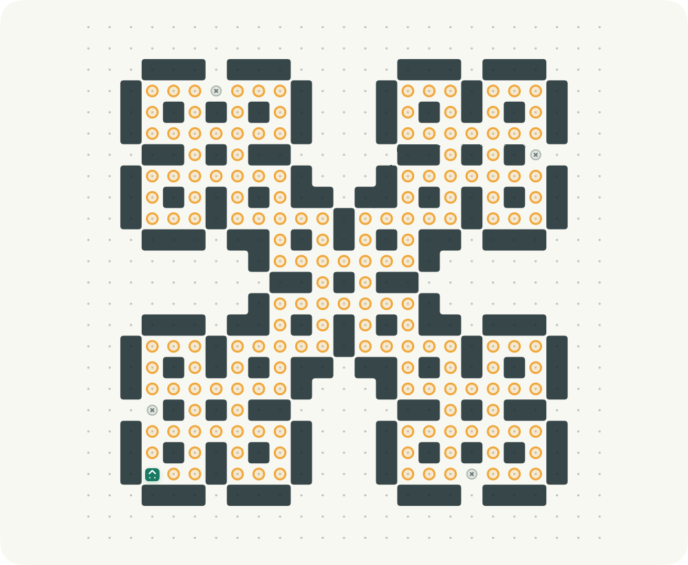
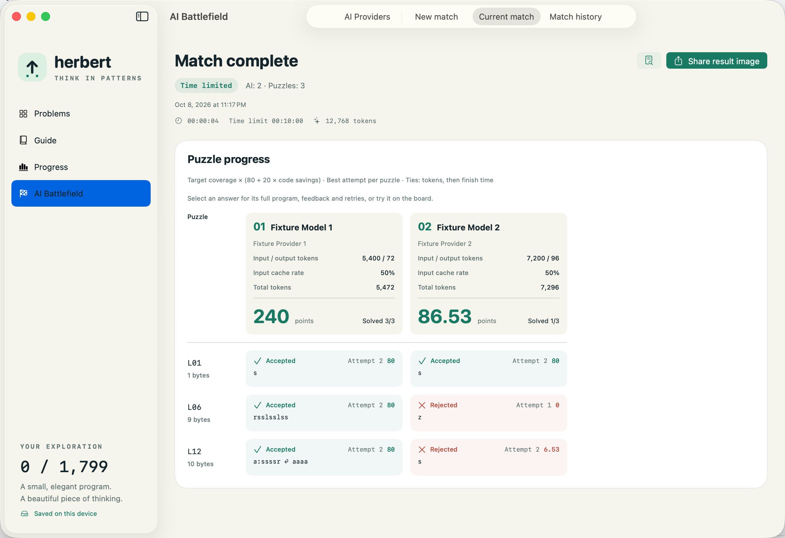
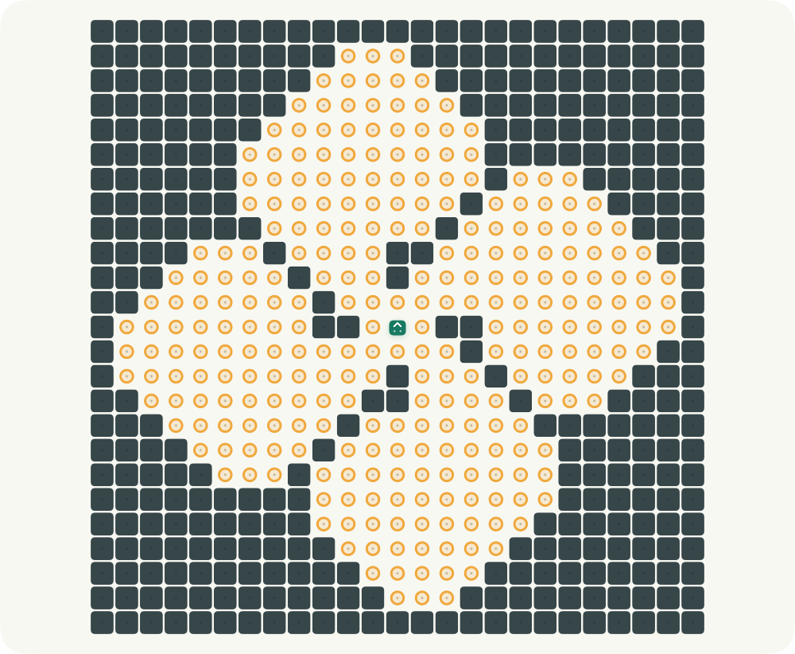
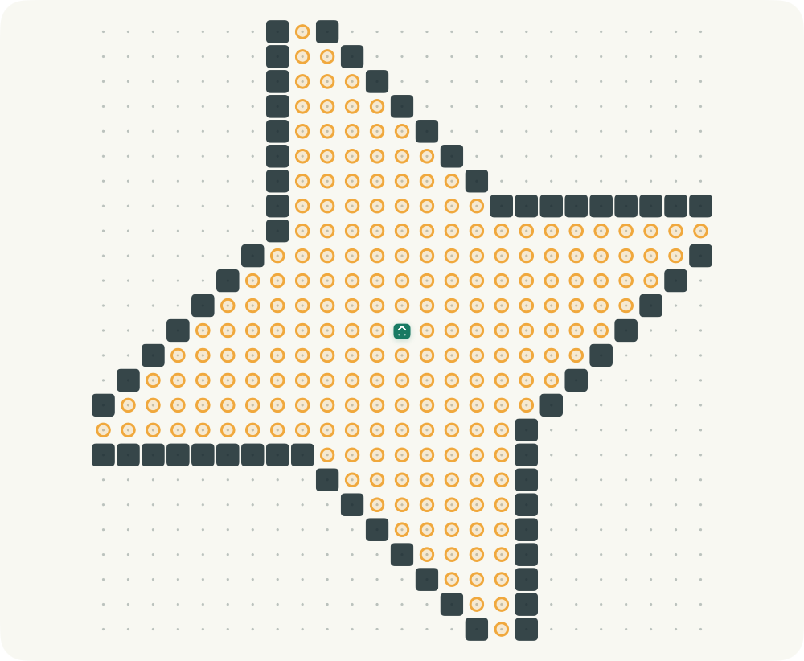
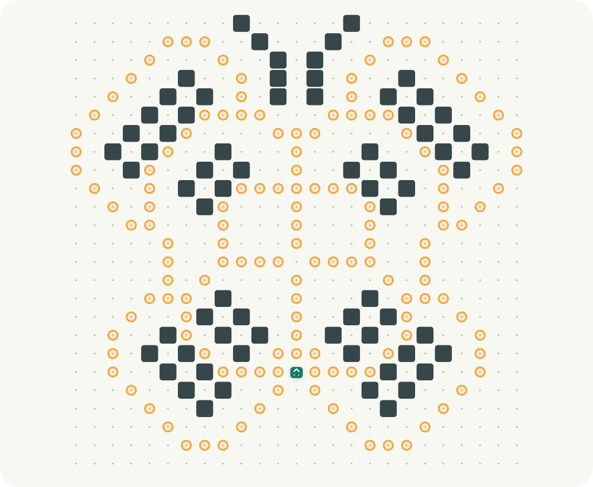
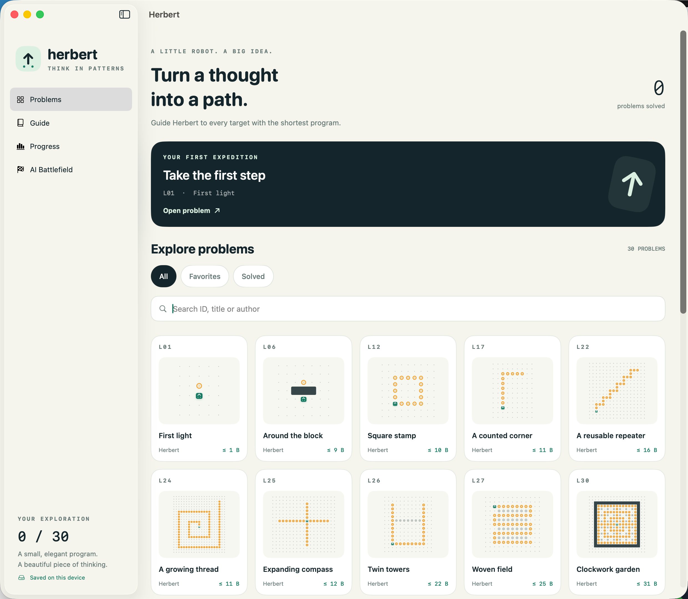

<p align="center">
  
</p>

<h1 align="center">Herbert</h1>
<p align="center">A little robot. A big idea. Find the shortest program through a world of patterns.</p>
<p align="center">
  <a href="https://github.com/hugogu/herbert/actions/workflows/ci.yml"></a>
  <a href="LICENSE"></a>
  
  
</p>
<p align="center"><b>English</b> · <a href="README.zh-CN.md">简体中文</a> · <a href="CONTRIBUTING.md">Contribute</a> · <a href="CHANGELOG.md">Changelog</a></p>

Herbert is an offline programming puzzle game for **iPhone, iPad, and Mac**, built with
SwiftUI. Guide the robot to every target using H, a tiny language whose short programs
can express surprisingly intricate paths. Learn three commands, discover recursion,
and keep making your solution smaller.

Start with **10 introductory lessons**, then explore **20 advanced challenges** in
wall-assisted counting, parameter swaps, recursive returns, mutual recursion and
composition. All **30 original puzzles** have English, Chinese and Japanese goals
and two optional hints, with reference programs verified by the native and HOJ engines.
The default open-source edition also includes **1,769 community problems**, preserving
their IDs, authors and byte limits. The **App Store edition contains only the 30 originals**.
The introductory selection is L01, L06, L12, L17, L22, L24, L25, L26, L27 and L30;
L31–L50 remain the advanced course. Only the first two fit a direct sequence of commands.
Numbering gaps preserve existing saves, and retired records remain importable.
Code and original lessons use MIT; the archived community content has a separate,
unconfirmed licensing status explained in [NOTICE.md](NOTICE.md).

## Download for Mac

**[Download the 0.3.2 preview DMG](https://github.com/hugogu/herbert/releases/download/v0.3.2/Herbert-macOS-universal.dmg)**
— macOS 14+, Apple Silicon and Intel. Open the DMG and drag Herbert to Applications;
no Xcode is needed. Includes all 1,799 problems.

This preview is ad-hoc signed and **not Apple notarized**. macOS may block its first
launch; follow [Apple's instructions](https://support.apple.com/en-us/102445) for
**System Settings → Privacy & Security → Open Anyway** if you trust the download.
See [checksums, installation and build details](docs/macos-distribution.md).

[Explore the original curriculum](docs/original-course.md) · [Design and community study](docs/advanced-course-design.md) · [App Store build and device testing](docs/app-store.md)



*Actual native macOS App Store edition with English UI. L49 “Vaulted mosaic” combines
shrinking tiers, window patterns and fourfold rotation. Its nested procedures must
return to their starting position and heading before the next pattern can fit.
The app follows English, Simplified Chinese, or Japanese language preferences; other
languages fall back to English.*

## Small programs, intricate places

The six-chapter [original course](docs/original-course.md) grows from a single `s` to
layered recursive systems. Walls reveal rooms, folds and rotational units while
constraining the route. These are three of the new challenges; click a board for its
full game screen:

| L38 · Hinged rosette | L44 · Snowmelt seal | L50 · Astral cathedral |
| --- | --- | --- |
| [](docs/screenshots/en/course/course-rosette.png) | [](docs/screenshots/en/course/course-seal.png) | [](docs/screenshots/en/course/course-cathedral.png) |
| Recursive return · ≤ 29 bytes | Selective instruction expansion · ≤ 34 bytes | Chiral branching + composition · ≤ 56 bytes |

*These original puzzles and their screenshots are MIT licensed. Budgets are verified
achievable, not proven minima. Our [community study and design notes](docs/advanced-course-design.md)
explain the progression and the simple-loop shortcuts removed during design.
The course is included in the Mac preview.*

## AI Battlefield

**Updated in 0.3.2:** inspect full responses and reasoning while comparing your own AI models. The app has four
main tabs; **AI Battlefield** contains **AI Providers → New match → Current match → Match history**.

- Connect multiple OpenRouter, SiliconFlow or OpenAI compatible providers, discover
  models through `/models`, and set default entrants and model parameters. Keys stay in Keychain.
- Choose models and puzzles, then run time-limited, token-limited or Best Effort matches.
  Models work in parallel with identical Markdown rules and board prompts.
- The Mac setup places entrants and puzzles side by side. Progress uses compact two-line
  answers and score-sorted model columns; widen the window to see more models.
- Model headers show scores, input/output/total tokens and cache rates. Select an answer
  to inspect every submission, native feedback and retry, then **Try on board** with the
  submitted code prefilled. **Back to match** returns to the results. Trials preserve
  personal drafts, shortest solutions and match scores.
- Full response shows received final text, model reasoning and credential-redacted provider
  error details, updating live and remaining available in history. Reasoning-only output
  explains output-cap exhaustion. Retry requests preserve reasoning and avoid empty assistant turns.
- Shared prompt `herbert-h-v3` includes coordinate rulers, target coordinates and two
  native-verified worked boards, including a recursive pinwheel separate from scored L50.
- Stop cancels active calls. Matches are saved locally and can be shared as PNG cards.
  **Best Effort ends the entire match when the first AI finishes its selected puzzle set**,
  including exhausted retries, and cancels the other entrants.

AI is optional and uses **your own API credits**. Streaming usage can be estimated or
partial; token budgets cannot guarantee a provider's final bill. iPhone/iPad matches end
when the app enters the background. [Setup and accounting](docs/ai-battlefield.md) · [Privacy](PRIVACY.md).

## Herbert Benchmark

Use the **30 retained original puzzles** as an AI programming benchmark: movement and
walls, numeric and instruction parameters, recursion, multiple procedures and their
composition. Every answer runs in the same bounded native H engine used for human play.
The platform measures actual board outcomes and code length, with no model acting as judge.

**Score per attempt = target coverage × (80 + 20 × code savings)**, where coverage is
final lit targets / total targets, and code savings is `1 − H bytes / puzzle byte limit`.
Round to two decimals, keep the best attempt per puzzle, and sum the scores. Compile-invalid
and over-limit programs earn zero; incomplete runs can earn partial points. Traps reset
coverage. A shorter accepted program earns more points. Robot steps do not affect score.
Rank by **score descending → total input + output tokens ascending → completion time**.
Cached input and all retries count toward token consumption. Older 0.3.0 histories retain
their original 100-per-solved-puzzle scoring and tie-breaks.

For repeatable comparisons, use the same puzzle set, attempt limit, output caps and shared
prompt, and record sampling/reasoning parameters. Equal **per-model token budgets** suit
resource comparisons; **Best Effort is a race** and can leave slower entrants unfinished.
History snapshots preserve the full shared prompt and its version, boards, parameters, received answers and the scoring policy;
provider model versions can still change. This composite score is our benchmark policy,
inspired by the original site's shortest-code ranking. [Scoring and limits](docs/ai-battlefield.md#judge-and-rank).



*Actual English app captures with deterministic test entrants, demonstrating rejection
and a successful retry. These scores illustrate the app; they are not commercial model results.*
[New match](docs/screenshots/en/battlefield/ai-new-match.png) ·
[Readable rules](docs/screenshots/en/battlefield/ai-rules.png) ·
[Providers](docs/screenshots/en/battlefield/ai-providers.png) ·
[Models](docs/screenshots/en/battlefield/ai-models.png) ·
[Native feedback](docs/screenshots/en/battlefield/ai-answer.png) ·
[Reasoning-only response](docs/screenshots/en/battlefield/ai-reasoning.png) ·
[Provider error details](docs/screenshots/en/battlefield/ai-provider-error.png) ·
[Board trial](docs/screenshots/en/battlefield/ai-trial.png) ·
[PNG share preview](docs/screenshots/en/battlefield/ai-share.png)

## Community patterns

The default open-source edition also includes the archived community collection.
These examples are excluded from the App Store edition. Search their IDs in `Herbert`:

<table>
  <tr>
    <td align="center" width="33%"><a href="docs/screenshots/en/flower.png"></a></td>
    <td align="center" width="33%"><a href="docs/screenshots/en/shuriken.png"></a></td>
    <td align="center" width="33%"><a href="docs/screenshots/en/butterfly.png"></a></td>
  </tr>
  <tr>
    <td align="center"><b>#0037 · Flower</b><br>nai · ≤ 20 bytes</td>
    <td align="center"><b>#0027 · Shuriken</b><br>snuke · ≤ 39 bytes</td>
    <td align="center"><b>#0361 · Butterfly</b><br>nadsuki · ≤ 27 bytes</td>
  </tr>
</table>

*These are board screenshots from the running app. Click a board to see its full game screen.*

## Modern or Classic

<table>
  <tr>
    <td align="center"><a href="docs/screenshots/en/course/course-mosaic.png"></a></td>
    <td align="center"><a href="docs/screenshots/en/course/course-mosaic-classic.png"></a></td>
  </tr>
  <tr><td align="center">Modern · default</td><td align="center">Classic · movement trail</td></tr>
</table>

*Both are actual app captures of original lesson L49. Classic follows the original
rules-page board appearance. Its screenshot follows three successful moves. Adjacent
walls share a continuous outline in both styles. Use the sliders button above the board
to change style, grid dots, and trail visibility.*

<details>
<summary>Explore the original course library</summary>



</details>

## What you can do

- **Learn one idea at a time.** Follow the 30-lesson course from one step to the Astral cathedral;
  reveal hints individually when you need them. Titles, goals and hints support all three languages.
- **Play anywhere offline.** The default edition bundles 1,799 problems; the App Store
  edition bundles 30 originals. Search by ID, title, or author;
  bookmark favorites and return to your last problem.
- **Think in H.** Use `s`, `l`, and `r`, then build single-letter procedures, numeric and
  command parameters, and recursive programs. Original byte-counting rules are preserved.
  See the [HOJ compatibility audit](docs/hoj-compatibility.md) for tested behavior and limits.
- **Watch your idea unfold.** Run, pause, reset, or single-step. Change speed, zoom the board,
  and switch between the full 25 × 25 grid and its occupied region. See the robot’s complete
  movement trail, including at Turbo speed.
- **Make the board yours.** Open the sliders button above the board to choose Modern
  (default) or Classic, show/hide grid dots for counting cells, and toggle the movement
  trail. Preferences stay on this device. Resetting or editing code clears the trail;
  hiding it keeps recording.
- **Play in your language.** English, Simplified Chinese, and Japanese cover navigation,
  the guide, accessibility, and interpreter errors. Community puzzle titles/authors are preserved.
- **Use a layout that fits.** Stacked board and editor on phones; side-by-side play on iPad
  and Mac. Native text editing, cursor-aware command buttons, and `⌘ Return` on Mac.
- **Keep your progress.** Drafts, favorites, and shortest solutions save locally. Export JSON
  backups and merge them back after their solutions have been replayed and validated.
- **Keep your privacy.** No app accounts, analytics SDKs or ads. Human play stays offline;
  optional AI requests go directly to the providers you configure. [Data details](PRIVACY.md).

## Try your first program

Open lesson **L01 · First light** and enter:

```text
s
```

Each `s` moves forward one square; `l` turns left and `r` turns right. Light every amber
ring within the problem's byte limit. Walls block movement. Traps erase lit targets.

The challenge is program size, not the number of steps. Each letter and each numeric
literal counts as one byte: `12` is one byte, and punctuation and whitespace are free.
The in-app guide introduces procedures and recursion; [rule notes](docs/rules.md) explain
the full language and compatibility limits. Programs execute in the custom H interpreter,
with bounded execution; they do not execute Swift or shell commands.

## Build and run

You need **macOS and Xcode 16+ with Swift 6**. The checked-in Xcode project uses a local
Swift package and has **no third-party package dependencies**. Xcode 27.0 is the locally
verified toolchain; CI uses the default Xcode on the macOS 26 runner.

```sh
git clone git@github.com:hugogu/herbert.git
cd herbert
open Herbert.xcodeproj
```

Choose the **Herbert** scheme and your Mac, iPhone, or iPad destination, then Run.
For a physical iOS device, select your own Development Team in Signing & Capabilities.
No developer account is configured in the repository.

| Scheme | Included content | Intended use |
| --- | --- | --- |
| `Herbert` (default) | 30 original lessons + 1,769 archived community puzzles | Open-source edition |
| `HerbertAppStore` | 30 original lessons only | TestFlight / App Store candidate |

The community archive is a separate optional Swift package target, not a runtime-hidden
file in the store app. CI audits built iOS and Mac store apps for content isolation.
Personal signing settings can go in ignored `Config/Local.xcconfig` as `DEVELOPMENT_TEAM = YOUR_TEAM_ID`.
See [device and archive instructions](docs/app-store.md) before uploading.

```sh
# Formatting, importer unit tests, and core unit/integration tests
scripts/check.sh

# Build the native Mac app
xcodebuild -project Herbert.xcodeproj -scheme Herbert \
  -destination 'platform=macOS' CODE_SIGN_IDENTITY=- build

# Compile for iPhone and iPad without signing
xcodebuild -project Herbert.xcodeproj -scheme Herbert \
  -destination 'generic/platform=iOS' CODE_SIGNING_ALLOWED=NO build

# Run native Mac UI tests (uses a separate test save file)
xcodebuild -project Herbert.xcodeproj -scheme Herbert \
  -destination 'platform=macOS' CODE_SIGN_IDENTITY=- test
```

**Status: early preview.** Core tests, native Mac UI flows, and iOS compilation have been
verified. iPhone/iPad runtime and real-device testing remain open; there is no App Store
or notarized binary release yet. See [verification details](docs/verification.md).

## How it is built

| Location | Responsibility |
| --- | --- |
| `Herbert/` | SwiftUI screens, native editors, animation, app state |
| `Sources/HerbertCore/` | UI-independent H parser, VM, board, session, progress storage |
| `Sources/HerbertCommunity/` | Optional community archive, excluded from App Store targets |
| `Sources/HerbertBattlefield/` | Provider protocol, streaming client, parallel competition engine, judging and local history |
| `Tests/HerbertCoreTests/` | Language unit tests and game/save/backup integration tests |
| `Tests/HerbertBattlefieldTests/` | AI engine, budgets, cancellation, persistence and HTTP/SSE integration tests |
| `HerbertUITests/` | Native UI tests and reproducible screenshot captures |
| `scripts/` | Project/icon generation, validated catalog import, local checks |
| `docs/` | Rules, provenance, architecture, screenshots, verification |

`HerbertCore` can be built and tested independently with `swift test`.
After adding or removing app Swift files, run `python3 scripts/generate_project.py`.
Generated project files are checked in; contributors do not need XcodeGen.

Progress goes through `ProgressRepository` into an atomic, versioned JSON file in the
system-provided Application Support directory. Cloud sync is planned, not implemented:
**App → authenticated Cloudflare Worker → D1**. Database credentials will stay out of
clients. Read the [architecture notes](docs/architecture.md) for merge and migration rules.

## Contributing

Bug reports, documentation improvements, localization, accessibility work, and device
testing are welcome. See [CONTRIBUTING.md](CONTRIBUTING.md) for setup, checks, and places
to start. For feature ideas, open an issue before a large implementation.

- [Report a bug](https://github.com/hugogu/herbert/issues/new?template=bug_report.yml)
- [Suggest an improvement](https://github.com/hugogu/herbert/issues/new?template=feature_request.yml)
- [Browse good first issues](https://github.com/hugogu/herbert/labels/good%20first%20issue)
- [Code of conduct](CODE_OF_CONDUCT.md) · [Security policy](SECURITY.md)

### Next steps

- Test and refine phone keyboard, rotation, touch, and accessibility behavior on devices.
- Refine English/Japanese translations while preserving original puzzle titles and author credits.
- Expand H compatibility fixtures and make execution easier to inspect.
- Finish device testing and App Store privacy/metadata preparation using the original-only scheme.
- Add optional authenticated cloud sync while keeping offline play first.

## Credits and license

Inspired by [Herbert Online Judge](http://herbert.tealang.info/), created by **quolc**, and
its problem authors. Original [rules](http://herbert.tealang.info/rule.php) and
[problem collection](http://herbert.tealang.info/problems.php) are linked for attribution.
The original Flash client, online accounts, submissions, and leaderboard are not included;
original best scores are an import-time snapshot, not live rankings.

Our source code, 30 original lessons, original icon, and documentation use the **[MIT License](LICENSE)**.
Third-party community puzzle data and community layouts visible in screenshots are
**not relicensed under MIT**. See [NOTICE.md](NOTICE.md) for the precise scope and provenance.
