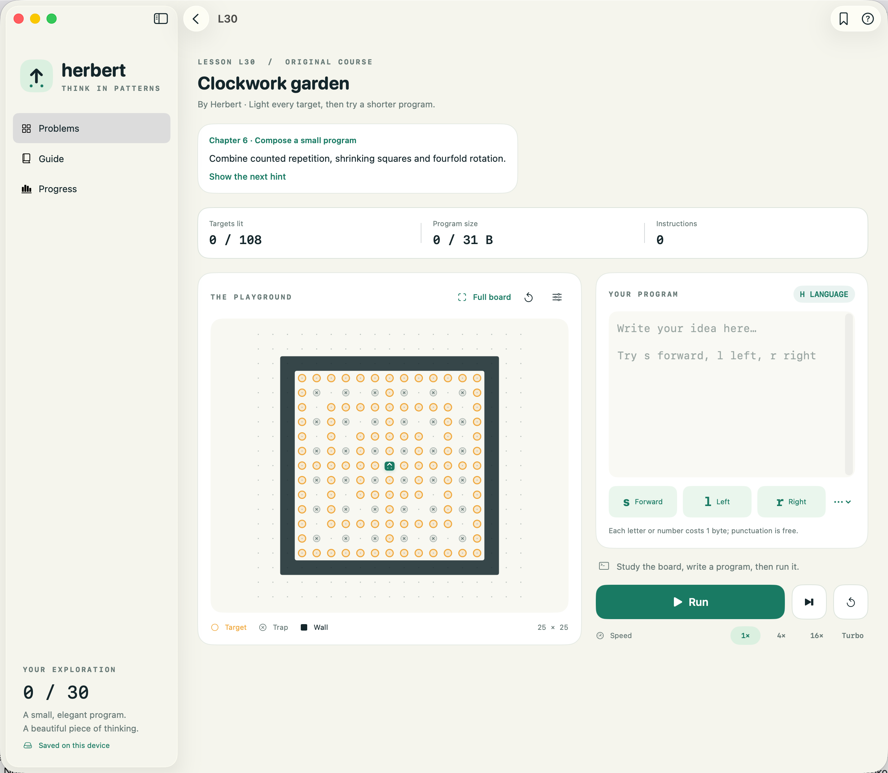
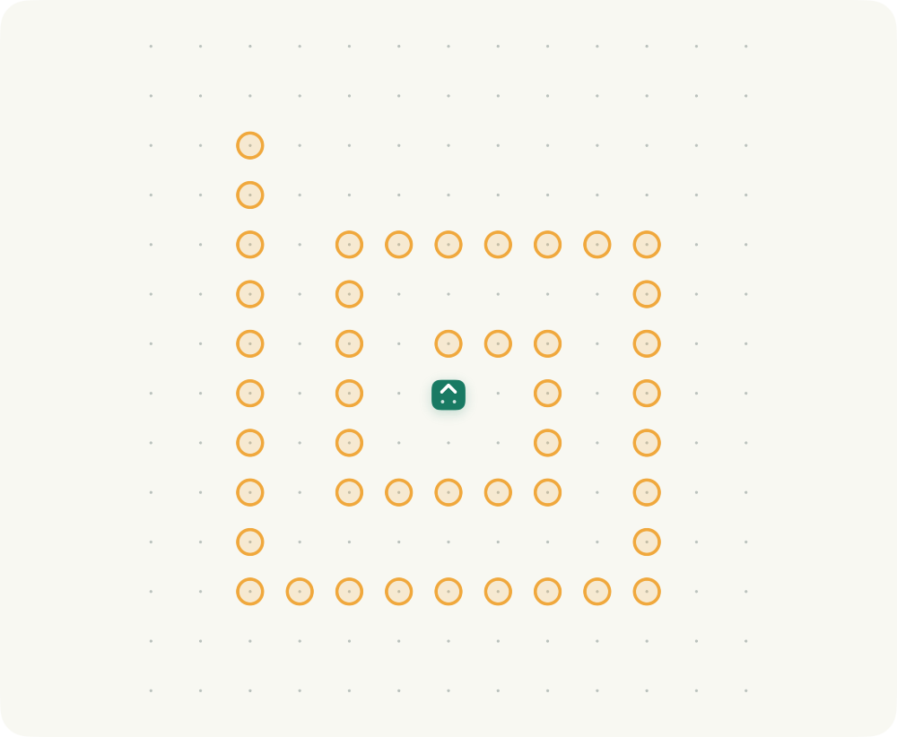
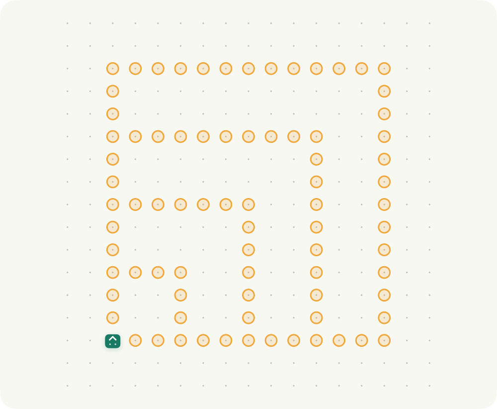
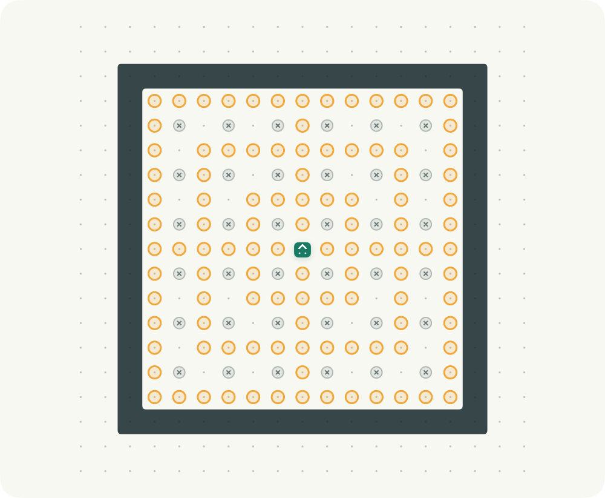
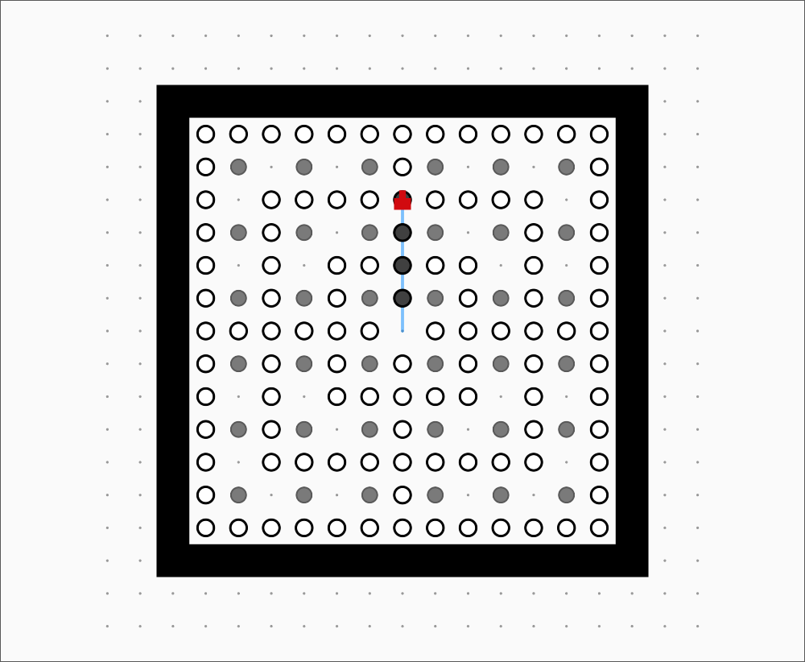

<p align="center">
  
</p>

<h1 align="center">Herbert</h1>
<p align="center">A little robot. A big idea. Find the shortest program through a world of patterns.</p>
<p align="center">
  <a href="https://github.com/hugogu/herbert/actions/workflows/ci.yml"></a>
  <a href="LICENSE"></a>
  
  
</p>
<p align="center"><b>English</b> · <a href="README.zh-CN.md">简体中文</a> · <a href="CONTRIBUTING.md">Contribute</a> · <a href="CHANGELOG.md">Changelog</a></p>

Herbert is an offline programming puzzle game for **iPhone, iPad, and Mac**, built with
SwiftUI. Guide the robot to every target using H, a tiny language whose short programs
can express surprisingly intricate paths. Learn three commands, discover recursion,
and keep making your solution smaller.

Start with **30 original lessons** that introduce movement, obstacles, procedures,
recursion and instruction parameters in six stages. Every lesson has localized goals
and two optional hints, with a reference program verified by the real H engine.
The default open-source edition also includes **1,769 community problems**, preserving
their IDs, authors and byte limits. The **App Store edition contains only the 30 originals**.
Code and original lessons use MIT; the archived community content has a separate,
unconfirmed licensing status explained in [NOTICE.md](NOTICE.md).

[Explore the original curriculum](docs/original-course.md) · [App Store build and device testing](docs/app-store.md)



*Actual native macOS App Store edition with English UI. L30 “Clockwork garden” combines
counted repetition, shrinking squares and rotation. The app follows English, Simplified
Chinese, or Japanese language preferences; other languages fall back to English.*

## From one step to a garden

The six-stage [original course](docs/original-course.md) grows from a single `s` to
procedures, recursion and instructions as arguments. These are three later lessons;
click a board to see its full game screen:

| L19 · Growing spiral | L29 · Nested windows | L30 · Clockwork garden |
| --- | --- | --- |
| [](docs/screenshots/en/course/course-spiral.png) | [](docs/screenshots/en/course/course-windows.png) | [](docs/screenshots/en/course/course-garden.png) |
| Numeric recursion · ≤ 16 bytes | Nested instruction arguments · ≤ 24 bytes | Composition · ≤ 31 bytes |

*These original puzzles and their screenshots are MIT licensed. Language and board
options, and the original course, are on `main` for the next release.*

## Community patterns

The default open-source edition also includes the archived community collection.
These examples are excluded from the App Store edition. Search their IDs in `Herbert`:

<table>
  <tr>
    <td align="center" width="33%"><a href="docs/screenshots/en/flower.png"></a></td>
    <td align="center" width="33%"><a href="docs/screenshots/en/shuriken.png"></a></td>
    <td align="center" width="33%"><a href="docs/screenshots/en/butterfly.png"></a></td>
  </tr>
  <tr>
    <td align="center"><b>#0037 · Flower</b><br>nai · ≤ 20 bytes</td>
    <td align="center"><b>#0027 · Shuriken</b><br>snuke · ≤ 39 bytes</td>
    <td align="center"><b>#0361 · Butterfly</b><br>nadsuki · ≤ 27 bytes</td>
  </tr>
</table>

*These are board screenshots from the running app. Click a board to see its full game screen.*

## Modern or Classic

<table>
  <tr>
    <td align="center"><a href="docs/screenshots/en/course/course-garden.png"></a></td>
    <td align="center"><a href="docs/screenshots/en/course/course-garden-classic.png"></a></td>
  </tr>
  <tr><td align="center">Modern · default</td><td align="center">Classic · movement trail</td></tr>
</table>

*Both are actual app captures of original lesson L30. Classic follows the original rules-page board
appearance. Its screenshot follows four instructions; only successful moves leave a trail.
Adjacent walls share a continuous outline in both styles. Use the sliders button above the board to change style, grid dots, and trail visibility.*

<details>
<summary>Explore the original course library</summary>


</details>

## What you can do

- **Learn one idea at a time.** Follow L01–L30 from one step to the Clockwork garden;
  reveal hints individually when you need them. Titles, goals and hints support all three languages.
- **Play anywhere offline.** The default edition bundles 1,799 problems; the App Store
  edition bundles 30 originals. Search by ID, title, or author;
  bookmark favorites and return to your last problem.
- **Think in H.** Use `s`, `l`, and `r`, then build single-letter procedures, numeric and
  command parameters, and recursive programs. Original byte-counting rules are preserved.
  See the [HOJ compatibility audit](docs/hoj-compatibility.md) for tested behavior and limits.
- **Watch your idea unfold.** Run, pause, reset, or single-step. Change speed, zoom the board,
  and switch between the full 25 × 25 grid and its occupied region. See the robot’s complete
  movement trail, including at Turbo speed.
- **Make the board yours.** Open the sliders button above the board to choose Modern
  (default) or Classic, show/hide grid dots for counting cells, and toggle the movement
  trail. Preferences stay on this device. Resetting or editing code clears the trail;
  hiding it keeps recording.
- **Play in your language.** English, Simplified Chinese, and Japanese cover navigation,
  the guide, accessibility, and interpreter errors. Community puzzle titles/authors are preserved.
- **Use a layout that fits.** Stacked board and editor on phones; side-by-side play on iPad
  and Mac. Native text editing, cursor-aware command buttons, and `⌘ Return` on Mac.
- **Keep your progress.** Drafts, favorites, and shortest solutions save locally. Export JSON
  backups and merge them back after their solutions have been replayed and validated.
- **Keep your privacy.** No accounts, analytics SDKs, ads, or app network requests.

## Try your first program

Open lesson **L01 · First light** and enter:

```text
s
```

Each `s` moves forward one square; `l` turns left and `r` turns right. Light every amber
ring within the problem's byte limit. Walls block movement. Traps erase lit targets.

The challenge is program size, not the number of steps. Each letter and each numeric
literal counts as one byte: `12` is one byte, and punctuation and whitespace are free.
The in-app guide introduces procedures and recursion; [rule notes](docs/rules.md) explain
the full language and compatibility limits. Programs execute in the custom H interpreter,
with bounded execution; they do not execute Swift or shell commands.

## Build and run

You need **macOS and Xcode 16+ with Swift 6**. The checked-in Xcode project uses a local
Swift package and has **no third-party package dependencies**. Xcode 27.0 is the locally
verified toolchain; CI uses the default Xcode on the macOS 26 runner.

```sh
git clone git@github.com:hugogu/herbert.git
cd herbert
open Herbert.xcodeproj
```

Choose the **Herbert** scheme and your Mac, iPhone, or iPad destination, then Run.
For a physical iOS device, select your own Development Team in Signing & Capabilities.
No developer account is configured in the repository.

| Scheme | Included content | Intended use |
| --- | --- | --- |
| `Herbert` (default) | 30 original lessons + 1,769 archived community puzzles | Open-source edition |
| `HerbertAppStore` | 30 original lessons only | TestFlight / App Store candidate |

The community archive is a separate optional Swift package target, not a runtime-hidden
file in the store app. CI audits built iOS and Mac store apps for content isolation.
Personal signing settings can go in ignored `Config/Local.xcconfig` as `DEVELOPMENT_TEAM = YOUR_TEAM_ID`.
See [device and archive instructions](docs/app-store.md) before uploading.

```sh
# Formatting, importer unit tests, and core unit/integration tests
scripts/check.sh

# Build the native Mac app
xcodebuild -project Herbert.xcodeproj -scheme Herbert \
  -destination 'platform=macOS' CODE_SIGN_IDENTITY=- build

# Compile for iPhone and iPad without signing
xcodebuild -project Herbert.xcodeproj -scheme Herbert \
  -destination 'generic/platform=iOS' CODE_SIGNING_ALLOWED=NO build

# Run native Mac UI tests (uses a separate test save file)
xcodebuild -project Herbert.xcodeproj -scheme Herbert \
  -destination 'platform=macOS' CODE_SIGN_IDENTITY=- test
```

**Status: early preview.** Core tests, native Mac UI flows, and iOS compilation have been
verified. iPhone/iPad runtime and real-device testing remain open; there is no App Store
or notarized binary release yet. See [verification details](docs/verification.md).

## How it is built

| Location | Responsibility |
| --- | --- |
| `Herbert/` | SwiftUI screens, native editors, animation, app state |
| `Sources/HerbertCore/` | UI-independent H parser, VM, board, session, progress storage |
| `Sources/HerbertCommunity/` | Optional community archive, excluded from App Store targets |
| `Tests/HerbertCoreTests/` | Language unit tests and game/save/backup integration tests |
| `HerbertUITests/` | Native UI tests and reproducible screenshot captures |
| `scripts/` | Project/icon generation, validated catalog import, local checks |
| `docs/` | Rules, provenance, architecture, screenshots, verification |

`HerbertCore` can be built and tested independently with `swift test`.
After adding or removing app Swift files, run `python3 scripts/generate_project.py`.
Generated project files are checked in; contributors do not need XcodeGen.

Progress goes through `ProgressRepository` into an atomic, versioned JSON file in the
system-provided Application Support directory. Cloud sync is planned, not implemented:
**App → authenticated Cloudflare Worker → D1**. Database credentials will stay out of
clients. Read the [architecture notes](docs/architecture.md) for merge and migration rules.

## Contributing

Bug reports, documentation improvements, localization, accessibility work, and device
testing are welcome. See [CONTRIBUTING.md](CONTRIBUTING.md) for setup, checks, and places
to start. For feature ideas, open an issue before a large implementation.

- [Report a bug](https://github.com/hugogu/herbert/issues/new?template=bug_report.yml)
- [Suggest an improvement](https://github.com/hugogu/herbert/issues/new?template=feature_request.yml)
- [Browse good first issues](https://github.com/hugogu/herbert/labels/good%20first%20issue)
- [Code of conduct](CODE_OF_CONDUCT.md) · [Security policy](SECURITY.md)

### Next steps

- Test and refine phone keyboard, rotation, touch, and accessibility behavior on devices.
- Refine English/Japanese translations while preserving original puzzle titles and author credits.
- Expand H compatibility fixtures and make execution easier to inspect.
- Finish device testing and App Store privacy/metadata preparation using the original-only scheme.
- Add optional authenticated cloud sync while keeping offline play first.

## Credits and license

Inspired by [Herbert Online Judge](http://herbert.tealang.info/), created by **quolc**, and
its problem authors. Original [rules](http://herbert.tealang.info/rule.php) and
[problem collection](http://herbert.tealang.info/problems.php) are linked for attribution.
The original Flash client, online accounts, submissions, and leaderboard are not included;
original best scores are an import-time snapshot, not live rankings.

Our source code, 30 original lessons, original icon, and documentation use the **[MIT License](LICENSE)**.
Third-party community puzzle data and community layouts visible in screenshots are
**not relicensed under MIT**. See [NOTICE.md](NOTICE.md) for the precise scope and provenance.
