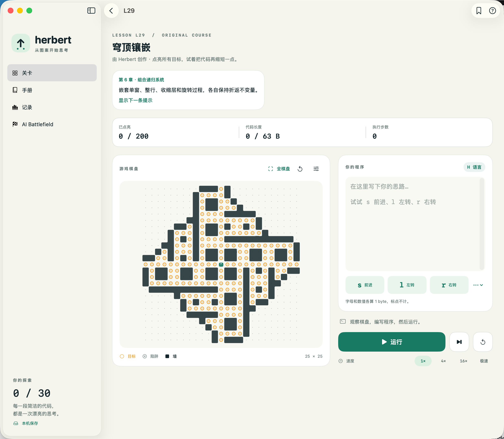
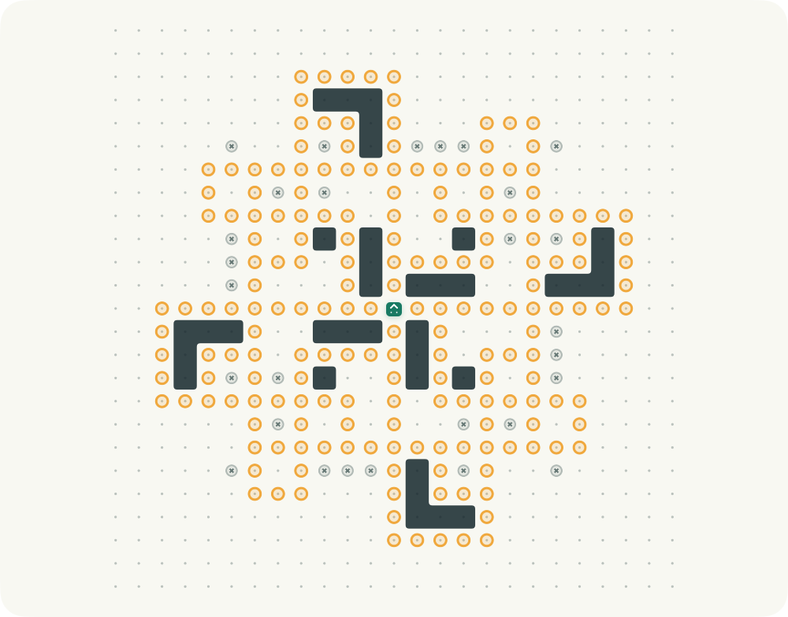
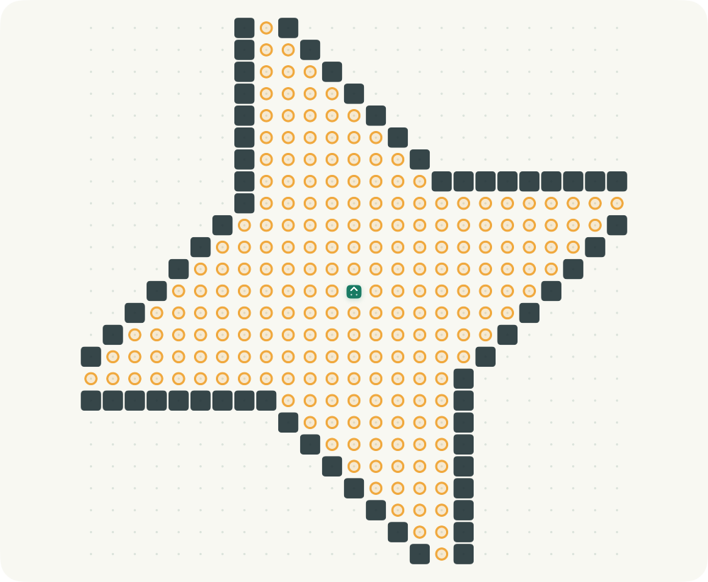
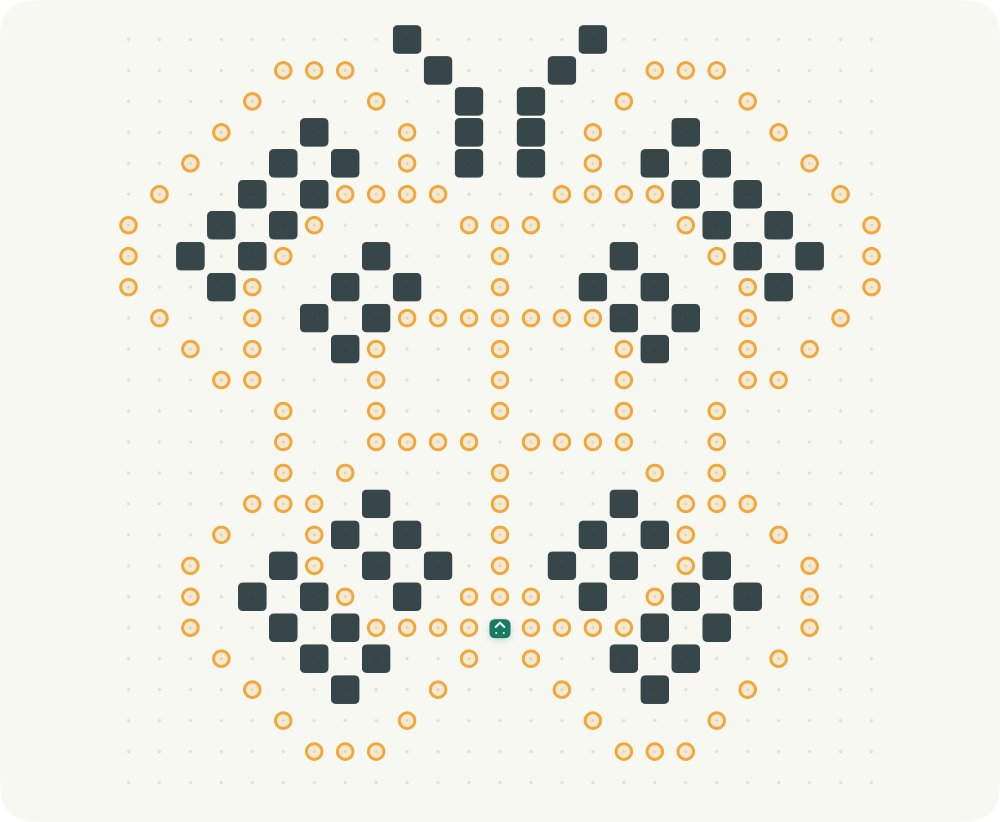
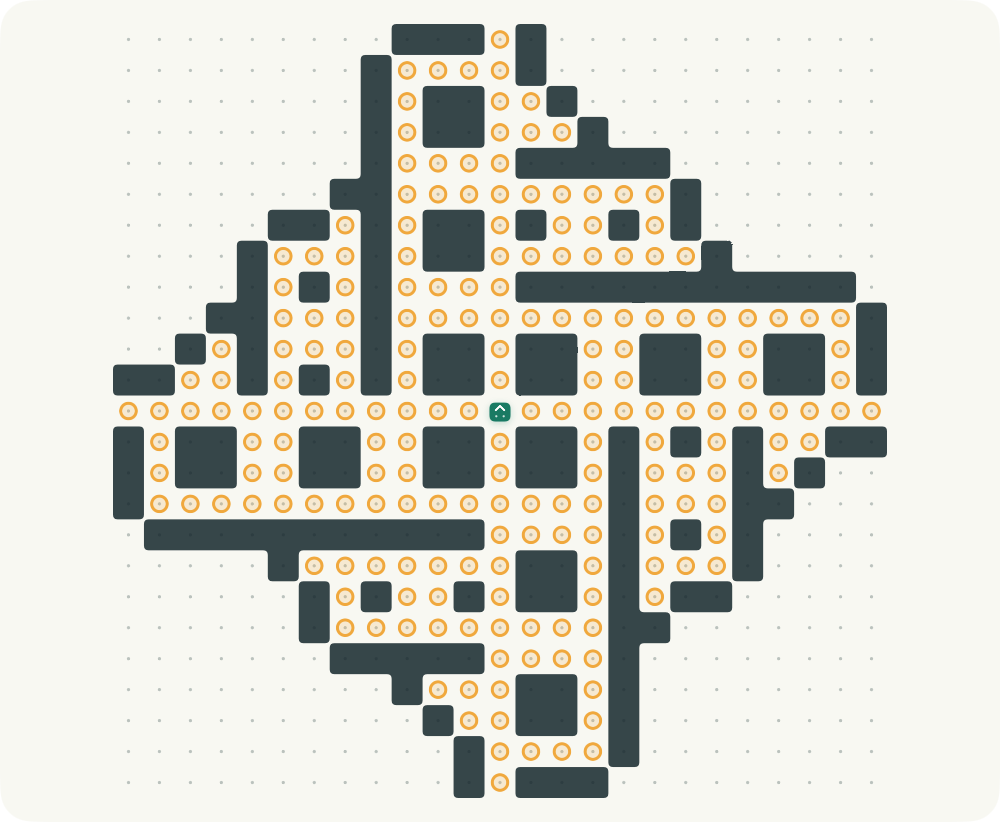
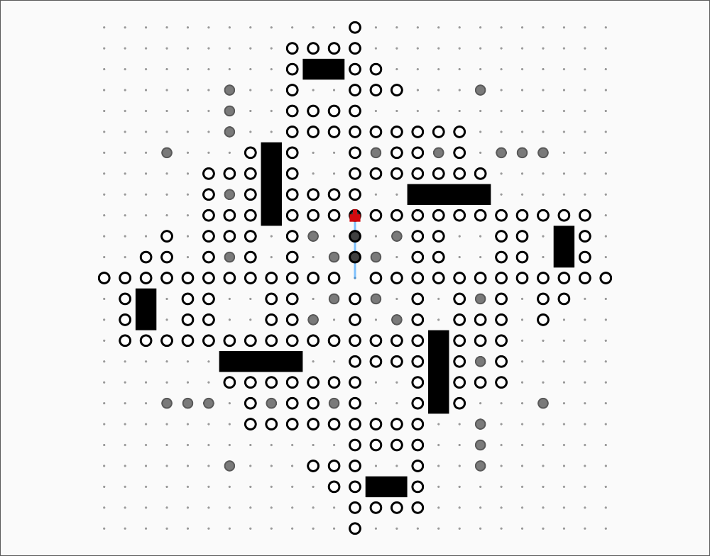

# Herbert

[English](README.md) · **简体中文** · [参与贡献](CONTRIBUTING.md) · [更新记录](CHANGELOG.md)

先从 **30 道基础课程关卡**学习移动、避障、过程、递归与指令参数，再挑战 **20 道进阶题**：
让墙参与计数、交换参数、递归折返、互递归及多层子程序组合。
全部 **50 道原创题 L01–L50** 都有中英日目标与两级提示，参考解通过原生引擎和 HOJ 参考引擎验证。
默认开源版另含 1,769 道社区题，共 **1,819 题**；`HerbertAppStore` 仅打包原创的 50 题。
[完整原创课程](docs/original-course.zh-CN.md) · [解题分析与进阶设计](docs/advanced-course-design.zh-CN.md) · [App Store 与真机测试](docs/app-store.md)

## 下载 Mac 版

**[下载 0.2.0 预览版 DMG](https://github.com/hugogu/herbert/releases/download/v0.2.0/Herbert-macOS-universal.dmg)**
— 支持 macOS 14+，同一个包兼容 Apple Silicon 和 Intel。打开 DMG，将 Herbert 拖到“应用程序”即可安装，无需 Xcode。包含全部 1,819 道题。

此预览版采用 ad-hoc 签名，**尚未经过 Apple 公证**。如果 macOS 阻止首次启动，确认信任下载来源后，可按 [Apple 指引](https://support.apple.com/en-us/102445)在“系统设置 → 隐私与安全 → 仍要打开”中确认。校验摘要、安装和构建方法见 [Mac 分发说明](docs/macos-distribution.md)。



*实际原生 Mac App 的中文截图。L49「穹顶镶嵌」组合收缩层、窗格与四向旋转；每层子过程都要恢复自己的位置和朝向，整体图案才接得起来。*

| L38 · 折页花窗 | L44 · 融雪方印 | L50 · 星穹圣殿 |
| --- | --- | --- |
| [](docs/screenshots/course/course-rosette.png) | [](docs/screenshots/course/course-seal.png) | [](docs/screenshots/course/course-cathedral.png) |
| 递归折返 · ≤ 29 bytes | 指令展开层选择 · ≤ 34 bytes | 旋向分杈与组合 · ≤ 56 bytes |

原创题目与这些截图均使用 MIT。预算已验证可达，不宣称最优解。难度来源、社区试解和去掉过于简单解法的过程见[设计说明](docs/advanced-course-design.zh-CN.md)。

## 社区题库示例

以下关卡来自默认开源版，App Store 版不包含这些社区题目。

| 0037 · Flower | 0027 · Shuriken | 0361 · Butterfly |
| --- | --- | --- |
| [](docs/screenshots/flower.png) | [](docs/screenshots/shuriken.png) | [](docs/screenshots/butterfly.png) |
| nai · ≤ 20 bytes | snuke · ≤ 39 bytes | nadsuki · ≤ 27 bytes |

截图来自运行中的 App；点击棋盘查看完整界面。**0.2.0 预览版**界面会自动匹配系统的中文、英文或日文语言偏好，其他语言回退至英文。

用最短的 H 语言程序，带 Herbert 点亮所有目标。原生 SwiftUI 游戏，共用一个与界面无关的游戏引擎，支持 **iPhone / iPad（iOS 17+）和原生 Mac（macOS 14+）**。

## 棋盘风格

| 现代风格（默认） | Classic 经典风格与轨迹 |
| --- | --- |
| [](docs/screenshots/course/course-mosaic.png) | [](docs/screenshots/course/course-mosaic-classic.png) |

两张均为原创 L49 的实际 App 截图，相邻墙格连接成连续轮廓。经典风格参考原站规则页中的棋盘，示例执行了三次成功移动。棋盘右上角的滑杆图标可设置风格、网格点和运动轨迹。0.2.0 已包含新增的进阶课程。

## 运行

需要 Xcode 16 或更新版本及 Swift 6，无第三方依赖；本机验证工具链为 Xcode 27.0。

```sh
open Herbert.xcodeproj
```

选择 `Herbert` scheme 和目标设备，点击 Run。连接 iPhone/iPad 真机时，在 Signing & Capabilities 中选择自己的 Development Team。项目没有预设签名账号。

| Scheme | 题库 | 用途 |
| --- | --- | --- |
| `Herbert`（默认） | 50 道原创题 + 1,769 道社区题 | 开源版 |
| `HerbertAppStore` | 仅 50 道原创题 | 真机检查、TestFlight、App Store 候选版 |

社区题库位于可选的 `HerbertCommunity` 模块，App Store target 不链接它；不是在界面中隐藏题目。
CI 对构建后的 iOS/Mac 包执行资源检查，拒绝社区数据或测试答案混入。
个人签名团队可写在被 Git 忽略的 `Config/Local.xcconfig` 中：`DEVELOPMENT_TEAM = YOUR_TEAM_ID`。

```sh
# 引擎、关卡、持久化与备份集成测试
swift test

# 格式检查和测试
scripts/check.sh

# 原生 Mac
xcodebuild -project Herbert.xcodeproj -scheme Herbert -destination 'platform=macOS,arch=arm64' CODE_SIGN_IDENTITY=- build

# iPhone / iPad 编译，不需要开发者签名
xcodebuild -project Herbert.xcodeproj -scheme Herbert -destination 'generic/platform=iOS' CODE_SIGNING_ALLOWED=NO build

# Mac 界面自动化（会启动测试专用游戏实例）
xcodebuild -project Herbert.xcodeproj -scheme Herbert -destination 'platform=macOS,arch=arm64' CODE_SIGN_IDENTITY=- test
```

## 已实现

- 原版 H 语言：`s/l/r`、单字母过程、递归、最多 26 个参数、可为空的命令参数、数值参数、加减法、非正参数跳过调用、±255 数值限制。
- 原版计数：每个字母 1 byte，每个数值常量 1 byte，标点与空白不计；每关按原站限制判定，步数不影响最短解记录；对照原解释器的发现与差异见 [兼容性审计](docs/hoj-compatibility.zh-CN.md)。
- 25×25 棋盘：目标、墙、陷阱，踩陷阱清空已点亮目标，撞墙或边界留在原地，点亮全部目标立即通关。
- 离线原版题库：保留编号、标题、作者、长度限制、原站最短记录快照、数据校验摘要与来源；数量和缺失项以 `docs/problem-import-manifest.json` 为准。
- 十章各五题的原创课程：独立设计的布局、稳定 ID 10001–10050、显示编号 L01–L50、三语名称/学习目标/提示；参考解只在测试资源中，不进安装包。
- 手机上下布局与固定运行栏；iPad/Mac 并排棋盘和编辑器；原生可选中文本编辑器、光标处插入指令、更多符号、代码模板、单步、暂停/继续、重置、4 档速度、触觉反馈。
- 有内容区域自动聚焦、完整棋盘切换、双指缩放和放大后拖动。颜色配合目标环、陷阱叉与墙形状区分元素，支持 VoiceOver 棋盘状态描述。
- 关卡搜索、入门/收藏/完成筛选、继续最近关卡、中英日分步玩法手册。
- 当前快照包含 **1,769 个可玩关卡**，来源列表全部 21 页，最后原版编号 2077；排除 0000 空占位项，缺失项为零。
- 自动保存草稿、收藏、最短解与完成日期；本地 JSON 原子写入；损坏存档暂停自动写入，避免覆盖原文件；JSON 备份导入/导出，导入前重放并校验解法，合并时保留更短的有效解。
- 中英日自动匹配：覆盖导航、玩法手册、无障碍描述和 H 语言错误提示；保留关卡原始名称和作者。
- 棋盘右上角设置支持现代（默认）/ Classic 经典风格、显示网格点、显示运动轨迹；偏好保存在本机，切换关卡和重启后保留。
- 轨迹记录当前运行走过的路径，单步和极速均完整记录；隐藏后继续记录，重新显示即可查看，重置棋盘或修改代码会清空。
- 切到后台自动暂停执行并保存；Mac 支持 `⌘ Return` 运行/暂停。

## 结构

```text
Herbert/                         SwiftUI 应用与平台文本编辑器
Sources/HerbertCore/              H 解析器、虚拟机、棋盘、会话与存档
Sources/HerbertCore/Resources/    原创题库与语言资源
Sources/HerbertCommunity/         可选社区题库，不进 App Store 包
Tests/HerbertCoreTests/           单元测试、原题通关与存档/备份集成测试
HerbertUITests/                  原生界面自动化
scripts/                        可重复的题库导入、图标和工程生成、检查脚本
docs/                           数据导入清单、规则核对说明、架构与验证记录
```

`Package.swift` 提供独立的 `HerbertCore` Swift package；Xcode 工程通过本地 package 引用它。`scripts/generate_project.py` 可重建已提交的工程，不需要 XcodeGen。增加或移除应用 Swift 文件后，运行此脚本即可更新工程。图标由 `scripts/generate_icon.swift` 绘制，资源已经内置。

## 本地存档与未来 Cloudflare

数据存于应用 Application Support 下的 `Herbert/progress.json`（沙盒中的实际位置由系统决定）。格式带 `schemaVersion`，同一格式也用于备份；未接入云端、账号或分析 SDK。

所有持久化通过 `ProgressRepository`。未来可在其上增加同步协调器，使用 **App → 已认证的 Cloudflare Worker → D1**。客户端不持有 Cloudflare API Token，不直接访问数据库。合并规则和数据迁移建议见 [架构说明](docs/architecture.md)。

## 原版来源与移植边界

- [原站规则](http://herbert.tealang.info/rule.php)
- [原站 Problems](http://herbert.tealang.info/problems.php)
- 原站由 quolc 创建，社区关卡归各作者所有；本项目独立编写游戏代码，没有打包或执行原站 Flash 客户端。
- 应用独立编写的代码、50 道原创题、图标和文档使用 [MIT 许可证](LICENSE)。原站未声明可再分发题库的许可证，授权范围尚未确认；社区题库及其截图布局不在本项目的 MIT 授权范围内。App Store scheme 不包含社区题库。详情见 [第三方内容说明](NOTICE.md)。
- 原站在线排名、账号、投稿与服务器评分未移植；应用展示个人最短代码记录。原站最短记录是导入时的快照，不进行在线比较。
- 按原版限制运行最多 100 万个机器人指令；为保证手机可取消执行，额外限制 100 万次解释器展开、4096 层非尾递归栈、16 KiB 源代码、64 层参数语法嵌套和 128 层运行时参数嵌套。命令参数与待执行栈使用 100 万单位的展开预算，尾递归不增长调用栈。这些保护可能比原站更早停止极端程序。

重新导入题库（会访问原站，默认最多四个并发连接，成功响应缓存，失败可重试）：

```sh
python3 scripts/import_problems.py
```

导入程序从公开列表发现全部页，排除原站 `0000 / Null` 占位项，逐一核对棋盘长度、符号、起点、目标和 byte 限制；有失败时会保存已取得的题目，并在清单列出缺失 ID，以非零状态退出。再次运行使用缓存，仅补取失败请求。原站仅提供旧 HTTP 接口，JSON 内置题库是离线资源，App 本身无需网络权限。

## 参与贡献

欢迎错误报告、翻译改进、无障碍改进和 iPhone/iPad 真机测试。请阅读
[贡献指南](CONTRIBUTING.md)、[社区行为准则](CODE_OF_CONDUCT.md) 和 [安全策略](SECURITY.md)。
CI 执行格式检查、单元/集成测试和 Mac/iOS 编译；原生界面测试需要交互式 Mac 桌面。
运行 `scripts/capture_screenshots.sh zh-Hans store` 生成原创课程截图；省略 `store` 则生成社区关卡截图。

当前尚未接入云同步或发布 App Store 版；Mac DMG 为未公证的预览版，iPhone/iPad 运行时验证仍待完成。
完整记录见 [验证说明](docs/verification.md)。
